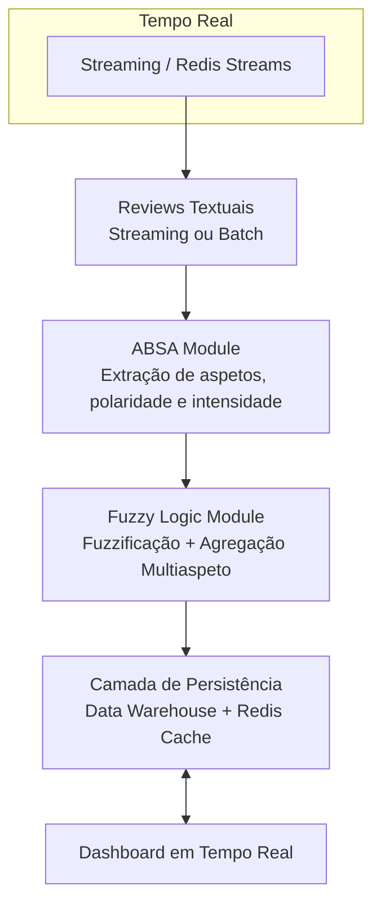

# Arquitetura do Sistema - Versão 1.0 (MVP)

**Projeto:** Expressão Gráfica em Tempo Real de Sentimentos Difusos Baseados em Aspetos  
**Autor:** Bruno de Sousa Afonso  
**Versão:** 1.0 (MVP - Março/Abril 2026)  
**Estado:** Em desenvolvimento (Sprint 0–1)

## 1. Visão Geral

O sistema implementa um pipeline completo de **Análise de Sentimentos Baseada em Aspetos (ABSA)** com **modelação difusa** e **visualização em tempo real**, conforme definido na pré-dissertação.

A arquitetura segue uma abordagem **modular em camadas** como apresentado abaixo.

### Diagrama de Arquitetura
